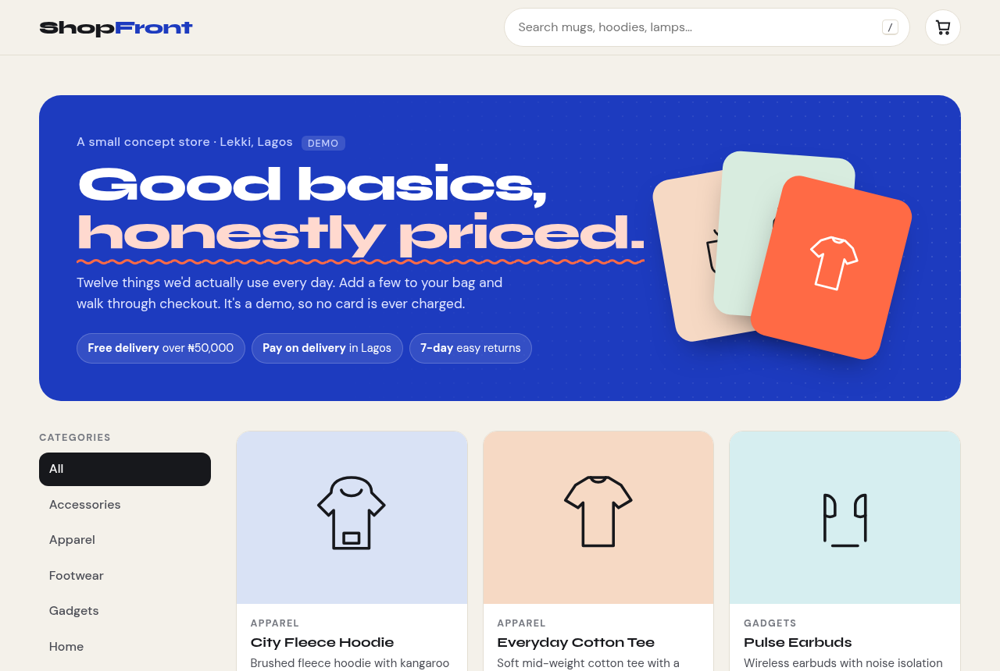
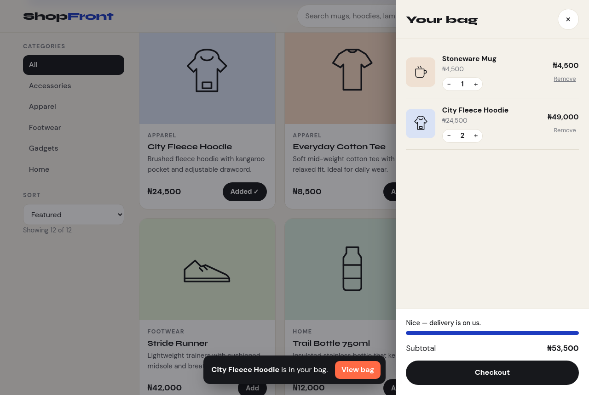
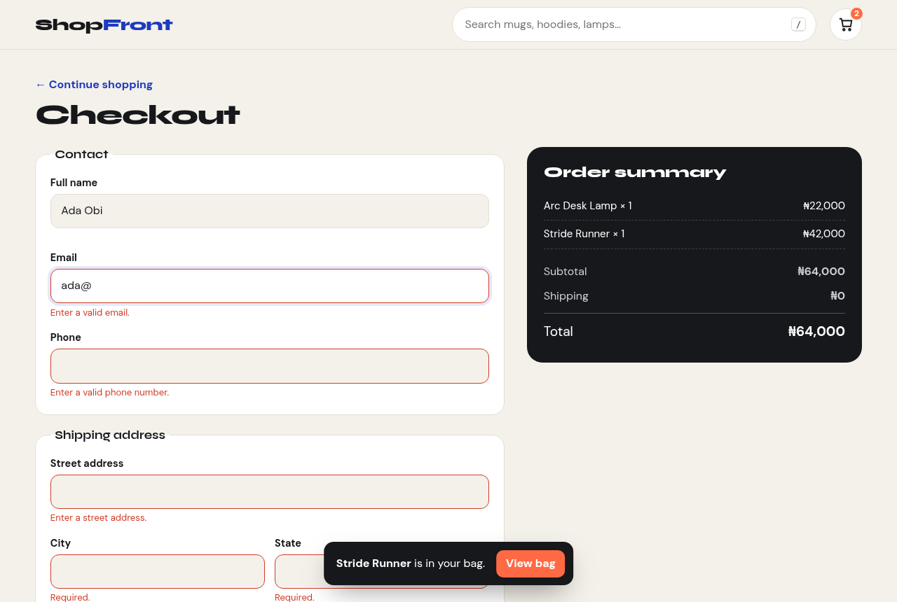

# ShopFront

ShopFront is a small, friendly online store I built to practise the parts of e-commerce that people actually touch: browsing, searching, a bag that remembers what you added, and a checkout form that tells you what's wrong without shouting at you.

It's a front-end demo. There's no backend and no real payment. Nothing you type into checkout leaves your browser. If you're a recruiter or a dev looking at my work, it's a good example of how I handle state, forms, and small UX details in plain JavaScript.

**Live demo:** https://dave-4u.github.io/projects/shopfront/



| Bag drawer | Checkout with inline validation |
|---|---|
|  |  |

## Quickstart

```bash
npm start                  # http://localhost:8080 (Node 18+, nothing to install)
# or: python3 -m http.server 8080
```

Tests (a real-browser walkthrough: search → add to bag → checkout → order placed):

```bash
npm install && npm test
```

## Features

- 12-item catalog with hand-drawn line illustrations, category filter, sort, and instant search (`/` to focus)
- Empty state with a one-click **Clear filters**
- "Added ✓" button feedback, a little bump on the bag icon, and a toast with **View bag**
- Bag drawer with quantity controls, plus a **free-delivery progress bar** (free over ₦50,000)
- The bag is saved in `localStorage`, so it survives a refresh
- Checkout with friendly inline errors. The first bad field gets focus, the card number formats itself (`4242 4242 …`), the brand (Visa / Mastercard / Verve) is detected, and expiry auto-inserts the `/`.
- Order confirmation with a reference number
- Keyboard: `/` search · `B` open bag · `Esc` close drawers and dialogs
- Responsive (2-column grid on phones), visible focus rings, and respects reduced motion

## Tech stack

HTML, CSS, and vanilla JavaScript, with no framework. Type is Syne for headings and DM Sans for body text. Tests use `playwright-core` driving your installed Chrome.

## Roadmap

- Product detail pages with sizes and colours
- Paystack test-mode checkout
- Wishlist and "recently viewed"
- A tiny Node/SQLite backend for real orders

## License

MIT © Adegboro David Oluwadamilare
